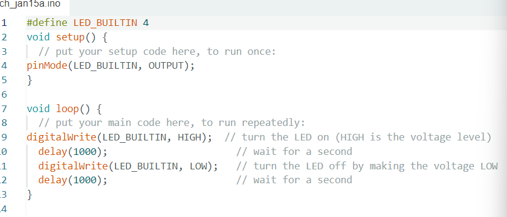
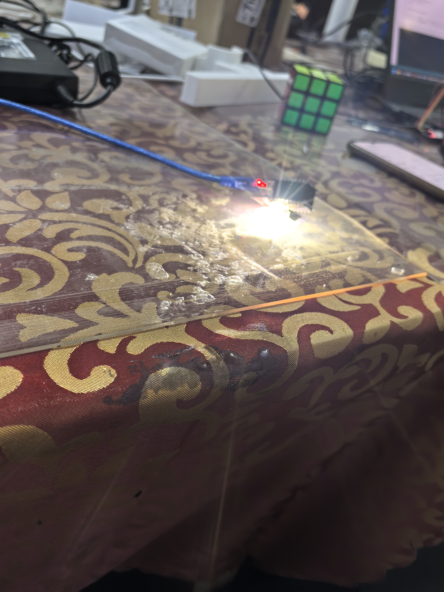
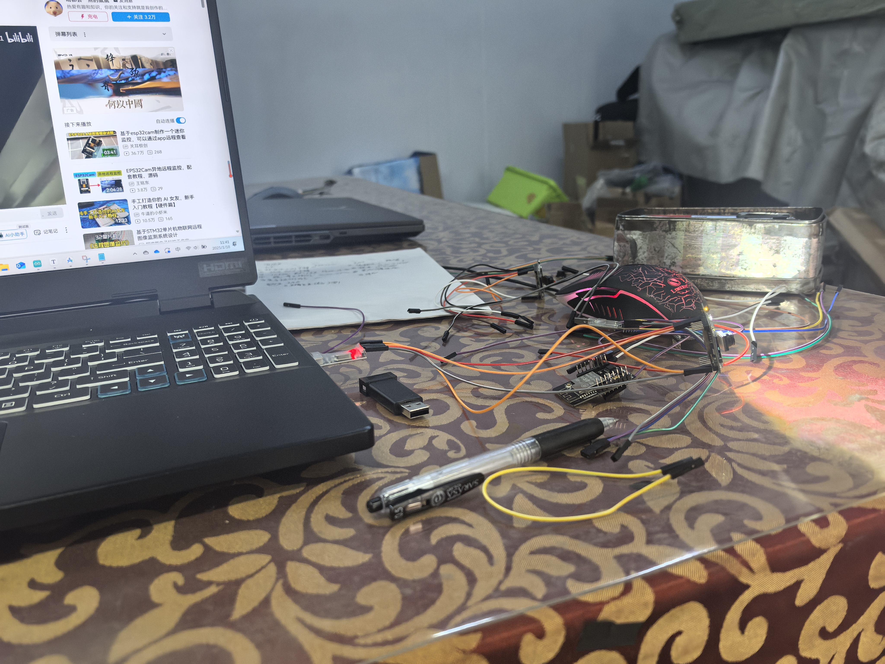
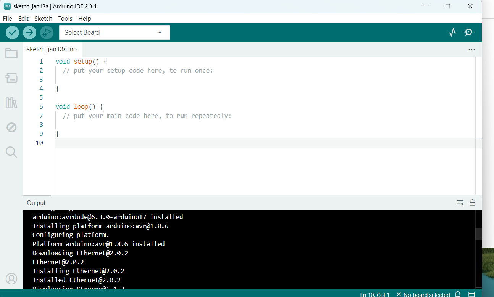
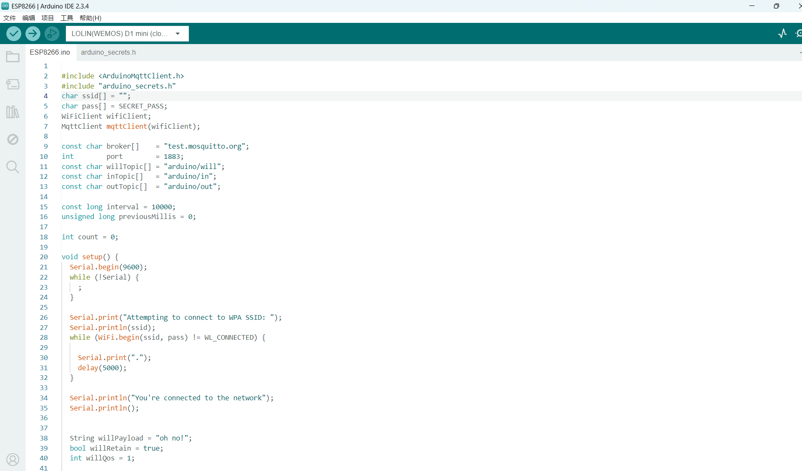
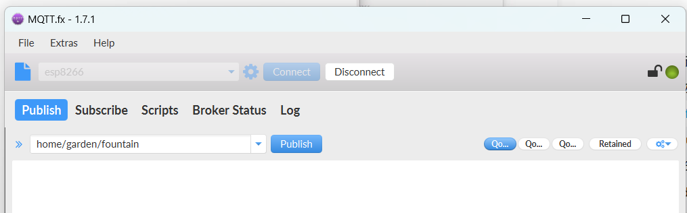
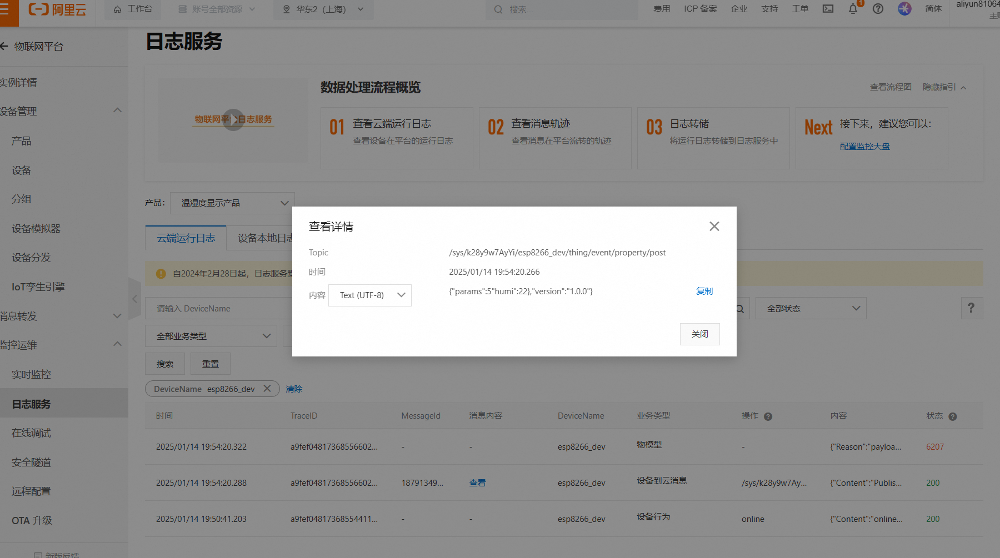
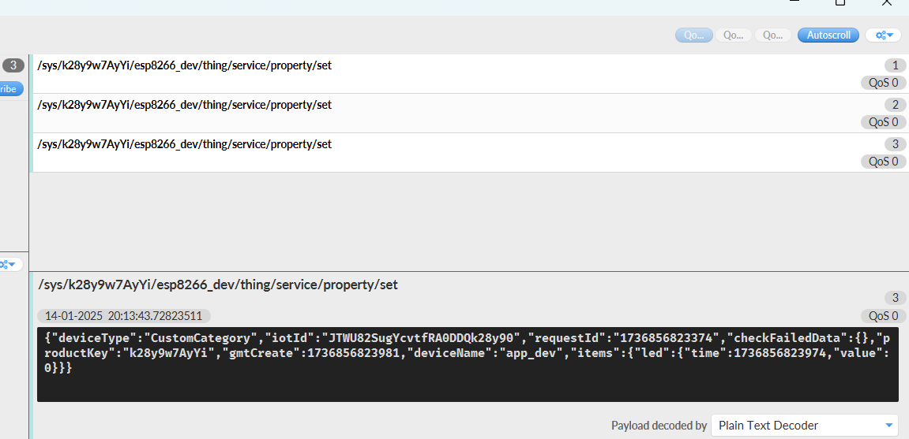

# TASK1 









```BLINK
void setup() {
  // put your setup code here, to run once:
pinMode(led_pin,OUTPUT);//设立引脚为输出模式
}

void loop() {
  // put your main code here, to run repeatedly:
  digitalWrite(led_pin,HIGH);//点亮LED
  delay(1000);//delay 1000ms
  digitalWrite(led_pin,LOW);
  delay(1000);

}
```





```代码
#include <ArduinoMqttClient.h>
#include <ESP8266WiFi.h>
#include <DFRobot_DHT11.h>
#include <ArduinoJson.h> 

 DFRobot_DHT11 DHT;
#define DHT11_PIN 5  //D1

char ssid[] = "hid318Pura70";    
char pass[] = "qwe123456";    
WiFiClient wifiClient;
MqttClient mqttClient(wifiClient);

const char broker[]    = "a1ic4mlGik0.iot-as-mqtt.cn-shanghai.aliyuncs.com";
int        port        = 1883;

const char inTopic[]   = "/sys/a1ic4mlGik0/esp8266_dev/thing/service/property/set";
const char outTopic[]  = "/sys/a1ic4mlGik0/esp8266_dev/thing/event/property/post";

const long interval = 10000;
unsigned long previousMillis = 0;

int count = 0;

void setup() {
  Serial.begin(9600);
  while (!Serial) {
    ; 
  }

  Serial.print("Attempting to connect to WPA SSID: ");
  Serial.println(ssid);
  while (WiFi.begin(ssid, pass) != WL_CONNECTED) {

    Serial.print(".");
    delay(5000);
  }


  Serial.println("You're connected to the network");
  Serial.println();

  mqttClient.setId("a1ic4mlGik0.esp8266_dev|securemode=2,signmethod=hmacsha256,timestamp=1690267863485|");                    //mqtt 连接客户端id
  mqttClient.setUsernamePassword("esp8266_dev&a1ic4mlGik0", "b7422044080e0f59e9e38cd408a2f1b87364133c07360510d0c7e3a17e2399bc");        //mqtt 连接用户名、密码


  Serial.print("Attempting to connect to the MQTT broker: ");
  Serial.println(broker);

  if (!mqttClient.connect(broker, port)) {
    Serial.print("MQTT connection failed! Error code = ");
    Serial.println(mqttClient.connectError());

    while (1);
  }

  Serial.println("You're connected to the MQTT broker!");
  Serial.println();

  mqttClient.onMessage(onMqttMessage);

  Serial.print("Subscribing to topic: ");
  Serial.println(inTopic);
  Serial.println();


  int subscribeQos = 1;

  mqttClient.subscribe(inTopic, subscribeQos);

  
  Serial.print("Waiting for messages on topic: ");
  Serial.println(inTopic);
  Serial.println();
}

void loop() {
  
  mqttClient.poll();

  
  unsigned long currentMillis = millis();

  if (currentMillis - previousMillis >= interval) {
   
    previousMillis = currentMillis;

    String payload;

   
    DHT.read(DHT11_PIN);

    //{"params":{"temp":1.22,"humi":22},"version":"1.0.0"}
  
  

    DynamicJsonDocument json_msg(512);
    DynamicJsonDocument json_data(512);

    json_data["temp"] = DHT.temperature;
    json_data["humi"] = DHT.humidity;

    json_msg["params"] = json_data;
    json_msg["version"] = "1.0.0";


    serializeJson(json_msg,payload);
    bool retained = false;
    int qos = 1;
    bool dup = false;

    mqttClient.beginMessage(outTopic, payload.length(), retained, qos, dup);
    mqttClient.print(payload);
    mqttClient.endMessage();

    Serial.println();

    count++;
  }
}

void onMqttMessage(int messageSize) {
 
  Serial.print("Received a message with topic '");
  Serial.print(mqttClient.messageTopic());
  Serial.print("', duplicate = ");
  Serial.print(mqttClient.messageDup() ? "true" : "false");
  Serial.print(", QoS = ");
  Serial.print(mqttClient.messageQoS());
  Serial.print(", retained = ");
  Serial.print(mqttClient.messageRetain() ? "true" : "false");
  Serial.print("', length ");
  Serial.print(messageSize);
  Serial.println(" bytes:");

 
  while (mqttClient.available()) {
    Serial.print((char)mqttClient.read());
  }
  Serial.println();

  Serial.println();
}

```





